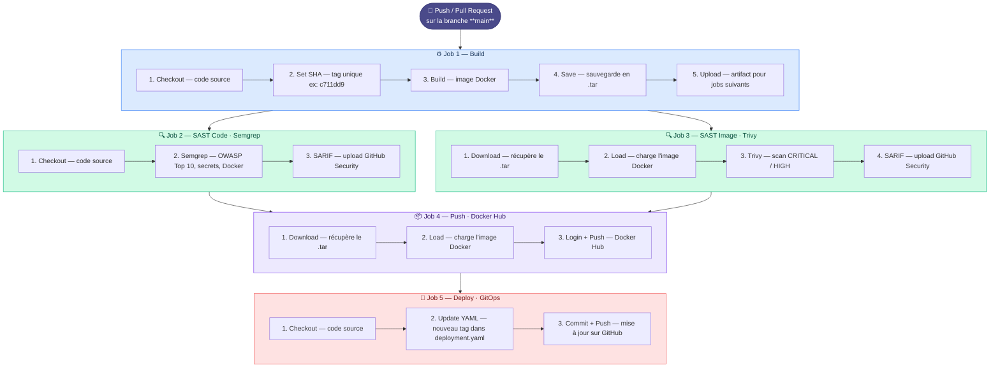

# Pipeline CI/CD - Explication étape par étape

## Déclencheur

Le pipeline se déclenche automatiquement lors d'un **Push** ou **Pull Request** sur la branche `master`.
Voici la version avec SAST intégré.Le SAST après le build et avant le push, ce qui est la bonne pratique : analyser le code source ET l'image avant de publier quoi que ce soit.

# Outils SAST intégrés :

1- Semgrep → analyse statique du code source (OWASP, secrets, vulnérabilités)
2- Trivy → scan de l'image Docker pour les CVE

---

## Architecture du Pipeline


---

## Résumé des Jobs

| Job | Rôle |
|-----|------|
| **Build** | Construit l'image Docker et la sauvegarde |
| **Push** | Envoie l'image sur Docker Hub |
| **Deploy** | Met à jour le fichier Kubernetes avec le nouveau tag |

---

## Flux des données

```
Code source
    │
    ▼
Image Docker (grassa77/gitomyapp:xxxxxxx)
    │
    ▼
Docker Hub (registre cloud)
    │
    ▼
deployment.yaml mis à jour → ArgoCD détecte → Déploie sur Kubernetes
```

---

## Pourquoi 3 jobs séparés ?

- **Isolation** : Chaque job tourne sur une VM différente
- **Parallélisme** : Possibilité d'ajouter des jobs en parallèle
- **Réutilisation** : On peut relancer un seul job si besoin

---

## Fichiers importants

| Fichier | Description |
|---------|-------------|
| `.github/workflows/build-deploy.yml` | Définition du pipeline CI/CD |
| `k8s/deployment.yaml` | Manifest Kubernetes (mis à jour automatiquement) |
| `Dockerfile` | Instructions de build de l'image |

---

## Utilisation

1. Modifie ton code
2. Commit et push sur `master`
3. Le pipeline s'exécute automatiquement
4. L'image est déployée sur Kubernetes via ArgoCD

## a la fin lancer git pull pour synchroniser avec le repo local 
1. git pull 
